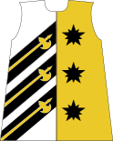
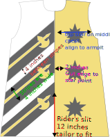

Rider's Surcoat
===============

   Diagram of the rider's surcoat

The rider's surcoat is popular with chivalric fighters and is designed so that it can be comfortably worn over armor. 
This design is a basic sleeveless surcoat, with a rider's slit up the front and back.

*NOTE*: This is NOT A BEGINNING sewing project.  
Sewing one of these requires advanced sewing skills, including comfort with machine applique on sharp points and tight curves. 
The barony runs periodic sewing days where we assembly-line these coats so that everybody can get one, regardless of skill.

   Diagram of the rider's surcoat showing the positioning of the stars and stripes

#############
Supply list:
#############

Fabric 
   - 2 yards white linen : https://fabrics-store.com/fabrics/linen-fabric-IL019-bleached-fs-signature-finish-middle
   - 1 yard black linen : https://fabrics-store.com/fabrics/linen-fabric-IL019-black-fs-signature-finish-middle
   - 2 yards Autumn gold linen : https://fabrics-store.com/fabrics/linen-fabric-IL019-autumn-gold-fs-signature-finish-middle
   - Heat-n-Bond lightweight fusible web

Thread (Coats and Clark “Dual Duty” All purpose thread)
   - 1 spool - White 
   - 2 spools - Black 
   - 2 spools - Golden Rod #7540 is a lighter yellow thread used for halberd applique stitching 
   - 1 spool - Mine Gold #7570 is a darker gold thread and is used for top stitching on the gold panels 

###################
Assembly
###################

**********************
Build right side panel
**********************
.. figure:: ../images/riders_panel_star.svg
   :name: riders_panel_star
   :alt: Diagram of the star panel of the rider's surcoat
   :figclass: align-center
   :align: center
   :scale: 60 %
   Diagram of the (right) star panel of the rider's surcoat

1. Cut a right side panel in gold linen for the front and one for the back (two panels, both right side).  
2. Serge or zigzag the edges
3. Iron black linen to your fusible and cut out 6 stars
4. Iron down your stars on each panel
     - Three stars per panel
     - Place stars 2 inches from the left center line
     - Place first star at the center chest, alighend with your armpit
     - Evenly space stars in a vertical line
5. Machine applique satin stitch the stars with the black thread.

************************
Build six halberd stripes
************************

.. figure:: ../images/riders_stripe.svg
   :name: riders_stripe
   :alt: Diagram of the stripe with halberd
   :figclass: align-center
   :align: center
   :scale: 60 %
   Diagram of the stripe with halberd

1. Iron black linen to your fusible and cut 6 stripes that are 4 inches wide and long enough to cover the diagonal of your surcoat pattern.  I know that they will be visually diagonal, but I recommend cutting the stripes on the grain so that they don't wiggle while you sew.  
2. Iron gold linen to your fusible and cut six halberds with shafts long enough to reach the end of your stripes.
3. Iron down the halberds to the stripes with a 1-inch margin from the center line. 
4. Machine applique satin stitch the halberds to the stripes using the lighter Golden Rod colored thread.  This color provides a lighter outline for the gold fabric.

*************************
Build left side panel
*************************

   Diagram of the (left) stripe panel of the rider's surcoat

1. Cut a left panel in white linen for the front and one for the back (2 panels, both left side).  
2. Serge or zigzag the edges
3. Iron down your completed halberd stripes
     - The bottom stripe is set at a 45 degree angle from the bottom left corner of the panel
     - Add each next halberd stripe to be parallel to the lower stripe at 4 inches above the bottom stripe
4. Machine applique satin stitch the stripes down with the black thread

***************************
Assemble the front and back
***************************

.. figure:: ../images/riders_split.svg
   :name: riders_split
   :alt: Diagram of the split seam on the front and back panels
   :figclass: align-center
   :align: center
   :scale: 60 %
   Diagram of the split seam on the front and back panels

1. Pin front panels together and back panels together. 
2. Mark the top of the riders slit.
3. Sew together panels from the neck to the rider's slit.
4. Baste together panels from the rider's slit to the bottom. 
5. Press open seams and top stitch both sides of the center line.  Use the Miner's Gold colored thread for top stitching on gold panel.  Use the white thread for top stitching the white panel.  
6. Remove the basting stitches on the rider's slit to open up the bottom
7. Reinforce the top of the rider's slit by stitching a horizontal bar across the center line.  This will prevent tearing up the center seam.  

***********************
Finishing
***********************

1. Make 1/2-inch bias tape from your black linen
2. Add bias tape to the neck and arm holes.  This reinforces areas of high stress and is pretty.
3. Hem the bottom panels
4. Ta Da!  Finished! 
