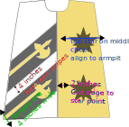

Tabard
===============

.. figure:: ../images/tabard_pic.svg
   :name: tabard_pic
   :alt: Diagram of the tabard
   :figclass: align-center
   :align: center
   :scale: 60 %

   Diagram of the tabard

The tabard is popular with fencers.  It is a basic tabard, with long swooping sleeves.

*NOTE*: This is NOT A BEGINNING sewing project.  
Sewing one of these requires advanced sewing skills, including comfort with machine applique on sharp points and tight curves. 
The barony runs periodic sewing days where we assembly-line these coats so that everybody can get one, regardless of skill.

   Diagram of the tabard showing the positioning of the stars and stripes

#############
Supply list:
#############

Fabric 
   - 2 yards white linen : https://fabrics-store.com/fabrics/linen-fabric-IL019-bleached-fs-signature-finish-middle
   - 1 yard black linen : https://fabrics-store.com/fabrics/linen-fabric-IL019-black-fs-signature-finish-middle
   - 2 yards Autumn gold linen : https://fabrics-store.com/fabrics/linen-fabric-IL019-autumn-gold-fs-signature-finish-middle
   - Heat-n-Bond lightweight fusible web

Thread (Coats and Clark “Dual Duty” All purpose thread)
   - 1 spool - White 
   - 2 spools - Black 
   - 2 spools - Golden Rod #7540 is a lighter yellow thread used for halberd applique stitching 
   - 1 spool - Mine Gold #7570 is a darker gold thread and is used for top stitching on the gold panels 

###################
Assembly
###################

************************
Build right side panel
************************

   Diagram of the (right) star panel of the tabard

1. Cut a right side panel in gold linen for the front and one for the back (two panels, both right side).  
2. Serge or zigzag the edges
3. Iron black linen to your fusible and cut out 4 stars
4. Iron down your stars on each panel
     - 2 stars per panel
     - Place stars 2 inches from the left center line
     - Place first star at the center chest, alighend with your armpit
     - Evenly space stars in a vertical line
5. Machine applique satin stitch the stars with the black thread.

************************
Build four halberd stripes
************************

   Diagram of the stripe with halberd

1. Iron black linen to your fusible and cut 4 stripes that are 4 inches wide and long enough to cover the diagonal of your tabard pattern.  I know that they will be visually diagonal, but I recommend cutting the stripes on the grain so that they don't wiggle while you sew.  
2. Iron gold linen to your fusible and cut six halberds with shafts long enough to reach the end of your stripes.
3. Iron down the halberds to the stripes with a 1-inch margin from the center line. 
4. Machine applique satin stitch the halberds to the stripes using the lighter Golden Rod colored thread.  This color provides a lighter outline for the gold fabric.

************************
Build left side panel
************************

   Diagram of the (left) stripe panel of the tabard

1. Cut a left panel in white linen for the front and one for the back (2 panels, both left side).  
2. Serge or zigzag the edges
3. Iron down your completed halberd stripes
     - The bottom stripe is set at a 45 degree angle from the bottom left corner of the panel
     - Add each next halberd stripe to be parallel to the lower stripe at 4 inches above the bottom stripe
4. Machine applique satin stitch the stripes down with the black thread

*********************
Sleeves
*********************

   Diagram of the sleeve

1. Cut out two gold sleeves and two white sleaves
2. Iron black linen to your fusible and cut out 2 stars
3. Iron down a star near the top of each of the gold sleeves
4. Machine applique satin stitch the stars with the black thread.

To assemble the sleeves we are going to "bag" them. 
  - First, pin the gold sleeve to the white sleeve with the star facing inside.  
  - Sew almost all the way around the sleeve, but leave a gap about 3 inches wide.  It's easiest if you leave the gap along the straight line on the bottom. 
  - Turn the sleeve inside out.  Carefully push the edges out flat and iron them down.  You can use a chopstick or a ruler if you need help pushing the edges out flat.  Iron the sleeve so that it is flat and the edges are smooth. 
  - Next top stitch along the edges, being careful to secure the gap at the bottom.  In your sewing machine, put gold thread on top and white thread on the bottom. 

********************
Body assembly
********************

   Diagram of the tabard body assembly

1. Pin front panels together and back panels together.  Sew together each of the panels from the neck to the bottom. 
2. Press open seams and top stitch both sides of the center line.  Use the Miner's Gold colored thread for top stitching on gold panel.  Use the white thread for top stitching the white panel.
3. Pin the front and back together at the shoulders and sew together.  
4. Make 1/2 inch biase tape from your black linen
5. Add bias tape to the neck and then along all the edges of the tabard.  This reinforces areas of high stress and is pretty.  

********************
Attache sleeves
********************

   Diagram of the tabard sleeve attachment

1. Pin the sleeve on the shoulder on the inside of the tabard.  The edge should line up with the biase tape.
2. Using black thread, sew the sleeve to the tabard just over the top of the shoulder 
3. Ta Da!  Finished! 
